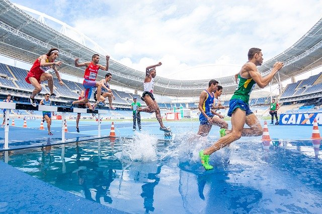
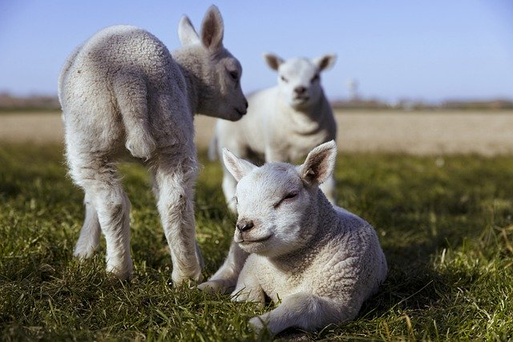
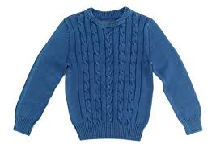
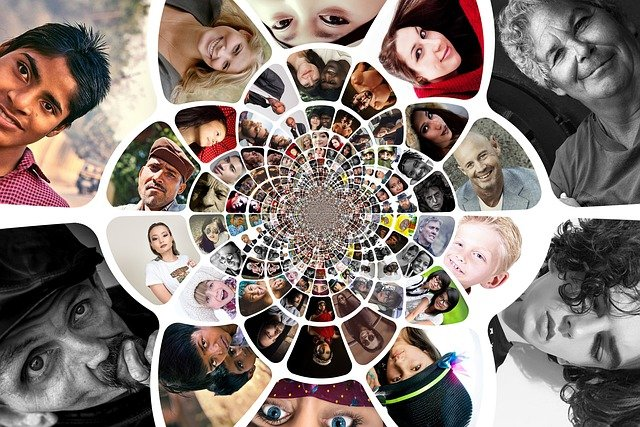
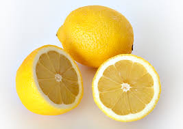
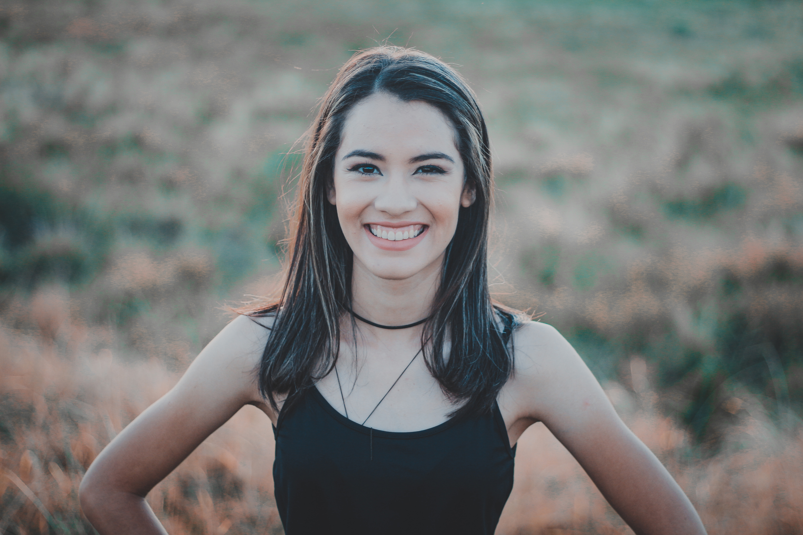

# Deep Learning Assignment 2: Lithuanian Image Captioning with Vision-Language Models

## Problem Definition

**Motivation:** Vision-language models (VLMs) like BLIP are trained on large English-centric datasets. They work well for English but often perform poorly on non-dominant languages like Lithuanian due to limited representation in pre-training data.

**The Problem:** How can we adapt a pre-trained VLM to generate **accurate image captions in Lithuanian**?

**Why This Matters:** Lithuanian is a low-resource language. By creating a curated dataset and fine-tuning a VLM on Lithuanian captions paired with images, we can teach the model to describe visual content in Lithuanian, enabling accessibility for Lithuanian speakers and advancing multilingual AI research.

## Goals & Objectives

### Core Tasks

1. **Dataset Preparation**
   - Collect and organize images across diverse semantic categories
   - Provide dual-language captions (English and Lithuanian) for each image
   - Ensure manual curation and representation of real-world visual content

2. **Model Fine-Tuning**
   - Adapt `Salesforce/blip-image-captioning-base` using the Lithuanian dataset
   - Use strategic fine-tuning: freeze vision encoder, train text decoder
   - Save best-performing checkpoint based on training metrics

3. **Model Validation**
   - Evaluate on held-out test images
   - Generate Lithuanian captions for unseen images
   - Report metrics: token F1-score and CLIP similarity

---
This task requires creating a new, unique small dataset and using it to fine-tune a VLM for Lithuanian language.

Main requirements
Dataset creation

Create a new, original dataset, not directly reused from existing benchmarks.
The dataset must target Lithuanian language.
Clearly describe:
data collection or annotation process,
dataset structure and size,
why the dataset is useful.
Model fine-tuning

Fine-tune a pretrained VLM using the created dataset.
Document the training setup and chosen fine-tuning method.
Demonstration

During assessment, demonstrate the model on new test inputs provided by the instructor.
Explain how the dataset influenced the model’s behavior.
You must be able to clearly explain how the dataset was created, how it was used, and why it is suitable for a lithuanian language.

---

## Dataset Overview

### Content

A **Lithuanian Image Captioning Dataset** with:
- **79 training images** across 13 semantic categories
- **13 test images** for each category
- **Dual captions**: English descriptions and Lithuanian translations for each image
- **Category-based organization**: Images organized by semantic content for better learning signal

### Dataset Categories

> [!CAUTION]
> **Class Imbalance Alert**: Dataset has significant category imbalance. `furniture/` and `complex/` have only 2 samples each, while `objects/` has 16. Consider this when interpreting per-category results.

| Category | Count | Examples |
|----------|-------|----------|
| `people/` | 14 | hairdresser, knight, family, cyclist |
| `animals/` | 7 | horse, dog, cat, sheep, snail |
| `nature/` | 5 | flowers, fireplace, trees, water, pine_cone |
| `objects/` | 16 | car, glasses, money, sculpture, garbage |
| `landscapes/` | 5 | ark, ice, nature, space |
| `miscellaneous/` | 8 | bubbles, star_wars, structure, game_cones |
| `furniture/` | 2 | bench, sofa |
| `tools/` | 6 | cutlery, pencils, tools |
| `activities/` | 3 | sport, firebreathing |
| `body_part/` | 3 | eye, feet_nails |
| `clothing/` | 3 | hat, socks, dresses |
| `complex/` | 2 | people_car, woman_horse |
| `food/` | 5 | peas, egg |

### Example Entries

**Example 1: People**
```json
{
  "image": "people/cyclist.jpg",
  "caption_en": "a girl riding a bicycle with a virtual reality glasses on",
  "caption_lt": "mergaitė važiuoja dviračiu, užsidėjusi virtualios realybės akinius"
}
```

**Example 2: Nature**
```json
{
  "image": "nature/flowers.jpg",
  "caption_en": "wildflowers in a field on the higher ground at sunset",
  "caption_lt": "laukinės gėlės lauke aukštumoje saulėlydžio metu"
}
```

**Example 3: Complex Scenes**
```json
{
  "image": "complex/people_car.jpg",
  "caption_en": "two women lying hair down on top of a car hood",
  "caption_lt": "dvi moterys guli, pasileidusios plaukus, ant automobilio kapoto"
}
```

### Why This Dataset Is Useful

> [!WARNING]
> **Small Dataset**: 79 training samples is limited for deep learning. Model may overfit or underfit. Increasing dataset size to 200+ samples recommended for robust performance.

- **Low-resource language**: Specifically targets Lithuanian with minimal pre-training representation
- **Semantic diversity**: 13 categories spanning everyday objects, people, nature, and complex scenes
- **Manual curation**: Accurate, natural captions not auto-translated
- **Organized structure**: Categorical organization helps model learn visual relationships

---

## Project Structure

```
Deep_learning_assignment2/
├── main.py                      # Main training and evaluation script
├── README.md                    # This file
├── LICENSE                      # Project license
├── _modules/                    # Core module package
│   ├── __init__.py              # Package initialization
│   ├── config.py                # Configuration and hyperparameters
│   ├── dataset.py               # Dataset class and utilities
│   ├── model.py                 # Training and evaluation functions
│   ├── plots.py                 # Visualization and plotting
│   ├── VLM.py                   # Vision-Language Model loading
│   └── write.py                 # File I/O utilities
├── data/                        # Dataset directory
│   ├── captions_train.json      # Training captions (79 samples)
│   ├── captions_test.json       # Test captions (13 samples)
│   └── images/
│       ├── train/               # Training images (13 categories)
│       └── test/                # Test images (13 categories)
└── output/                      # Results and model checkpoints
    ├── results.txt              # Training and evaluation logs
    ├── training_loss.png        # Loss and time per epoch
    ├── training_metrics.png     # Validation metrics (if VAL_SPLIT > 0)
    └── models/                  # Saved model checkpoints
        ├── best/                # Best checkpoint by loss
        └── config.json, model.safetensors, etc.
```

---

## Data Format Reference

Caption files are JSON arrays with this structure:

```json
{
  "image": "category/filename.jpg",
  "caption_en": "English description",
  "caption_lt": "Lithuanian description"
}
```

**Image paths** are relative to `data/images/train/` (training) or `data/images/test/` (evaluation).

---

## Project Structure

```
_modules/
  ├── config.py           # Hyperparameters and paths
  ├── VLM.py              # Model and processor loader
  ├── model.py            # Training and evaluation logic
  ├── dataset.py          # PyTorch Dataset
  └── write.py            # Logging utilities
  └── plots.py            # Visualizing the results
data/
  ├── images/train/       # 79 training images in category subfolders
  ├── images/test/        # 13 test images in category subfolders
  ├── captions_train.json
  └── captions_test.json
output/
  ├── results.txt         # Training logs
  └── models/
      ├── final/          # Final model
      └── best/           # Best checkpoint
main.py                    # Entry point
```

---

## Recent Pipeline Updates

### v2 Enhancements

**Data Augmentation:**
- ✨ **Mosaic Augmentation:** 50% of training batches create 2×2 image mosaics, combining visual contexts and improving model robustness
- Combined captions per mosaic for richer training signal
- Helps prevent overfitting on small dataset

**Experiment Infrastructure:**
- ✨ **OpenImages Domain Comparison:** Three-way model evaluation (main model on Lithuanian → main model on OpenImages → OpenImages model on OpenImages)
- Automatic FiftyOne Zoo dataset building with `horse`, `dog`, `background` classes
- Visual test preview with 5 random samples showing predicted vs ground truth captions
- BLEU-1 and CIDEr-1 metrics for simple single-word caption evaluation

**Improved Metrics:**
- Parameterized metric computation (supports n-gram sizes 1-4)
- Per-sample metric tracking during evaluation
- Detailed logging with metric suffix formatting

**Code Organization:**
- [`_modules/experiment.py`](_modules/experiment.py): Dedicated OpenImages experiment orchestration
- [`_modules/dataset.py`](_modules/dataset.py): Flexible dataset class with mosaic support
- [`_modules/model.py`](_modules/model.py): Enhanced training and evaluation with n-gram configuration

---

> [!NOTE]
> **Low-Resource Language Challenge**: Lithuanian has minimal representation in BLIP's pre-training data. Performance will be inherently lower than English. This is expected behavior, not a bug.

### Fine-Tuning Strategy

```python
# Freeze vision encoder to preserve pre-trained visual features
for param in model.vision_model.parameters():
    param.requires_grad = False

# Train only the text decoder for Lithuanian captions
optimizer = th.optim.AdamW(
    filter(lambda p: p.requires_grad, model.parameters()),
    lr=cfg.LEARNING_RATE
)
```

This approach:
- **Preserves visual understanding** from pre-training
- **Adapts language generation** to Lithuanian
- **Prevents catastrophic forgetting** on small datasets

### Data Augmentation

#### Mosaic Augmentation

The training pipeline applies **mosaic data augmentation** to enhance model robustness and improve generalization on limited data:

**How it works:**
- During training, 50% of batches apply mosaic augmentation
- Combines 4 images into a single 2×2 grid image (output: 224×224, each quadrant: 112×112)
- Combined captions are joined with `+` separator (e.g., "a horse + a dog + nature + background")
- The augmented batch includes both original images AND mosaic versions, increasing batch diversity

**Purpose:**
- Forces the model to learn spatial relationships and context from multiple images
- Improves model's ability to handle complex multi-object scenes
- Increases effective training data without requiring additional annotations
- Regularization effect helps prevent overfitting on small datasets

**Configuration:**
- Mosaic probability: 50% per batch during training
- Applied in `collate_fn()` with `apply_mosaic=True`
- Evaluation and test phases skip augmentation for fair metric comparison

**Implementation details** are in [`_modules/dataset.py`](_modules/dataset.py):
- `create_mosaic(images, size=224)`: Creates 2×2 grid from 4 images
- `collate_fn(batch, apply_mosaic=True, mosaic_probability=0.5)`: Applies augmentation during batch collation

### Hyperparameter Tuning Reference

| Parameter | Config Variable | Typical Default | Current Value | Description |
|-----------|-----------------|-----------------|----------------|-------------|
| **Training Epochs** | `EPOCHS` | 5-10 | 10 | Number of complete passes through training data |
| **Learning Rate** | `LEARNING_RATE` | 1e-4 to 1e-5 | 3e-5 | AdamW optimizer step size (conservative for fine-tuning) |
| **Batch Size** | `BATCH_SIZE` | 16-32 | 8 | Samples per gradient update (tuned for GPU memory) |
| **Validation Split** | `VAL_SPLIT` | 0.2 | 0.1 | Fraction of training data reserved for validation |
| **Train Subset Ratio** | `TRAIN_SUBSET_RATIO` | 1.0 | 1.0 | Fraction of training data to use (1.0 = all data) |
| **Beam Search Width** | `NUM_BEAMS` | 1 | 5 | Number of beams for beam search (1 = greedy) |
| **Sampling Mode** | `DO_SAMPLE` | False | True | Enable temperature-based sampling for diversity |
| **Temperature** | `TEMPERATURE` | 1.0 | 0.7 | Sampling temperature (lower = deterministic) |
| **Max New Tokens** | `max_new_tokens` | 50-128 | 50 | Maximum caption length (tokens) |
| **Repetition Penalty** | `repetition_penalty` | 1.0 | 1.2 | Penalty for repeated n-grams (>1.0 discourages repetition) |
| **No Repeat N-gram Size** | `no_repeat_ngram_size` | 0 | 3 | Block repeated n-grams of this size |
| **Early Stopping** | `early_stopping` | False | True | Stop search when no improvements found |
| **Mosaic Augmentation Probability** | (collate_fn) | 0.5 | 0.5 | Probability of applying 2×2 mosaic augmentation per batch |

**Configuration Location:** [`_modules/config.py`](_modules/config.py)

**Key Tuning Guidelines:**
- ↑ **Increase `EPOCHS`** if model is underfitting (improving loss)
- ↓ **Decrease `LEARNING_RATE`** if training is unstable (spikes/NaN)
- ↓ **Decrease `BATCH_SIZE`** if out of memory; ↑ if training is slow
- ↑ **Increase `TEMPERATURE`** for more diverse captions; ↓ for more deterministic
- ↑ **Increase `NUM_BEAMS`** for higher quality (slower); ↓ for faster inference
- ↓ **Decrease `repetition_penalty`** if model avoids needed repetition

### Optional OpenImages Experiment

The repository includes an opt-in experiment path for a **three-way model comparison** using the FiftyOne Open Images dataset with simple, single-word captions.

#### Experiment Overview

**Purpose:** Evaluate model performance across three scenarios:
1. Main model (trained on Lithuanian dataset) → evaluated on Lithuanian test set
2. Main model (trained on Lithuanian dataset) → evaluated on OpenImages test set
3. OpenImages model (trained from scratch on OpenImages) → evaluated on OpenImages test set

This comparison reveals:
- How well the main model generalizes to different image domains
- Whether domain-specific training improves performance
- The impact of dataset domain shift on caption quality

#### Enabling the Experiment

Set these configuration flags in [`_modules/config.py`](_modules/config.py):

```python
USE_EXPERIMENT = True                    # Enable all experiments
USE_OPENIMAGES_EXPERIMENT = True         # Enable OpenImages experiment
```

#### Dataset Details

- **Source:** FiftyOne Zoo Open Images v7 with object detection labels
- **Classes:** `horse`, `dog`, `background` (negative samples without these objects)
- **Simple Captions:** Single-word labels ("a horse", "a dog", "a background")
- **Split:** 80% training / 20% test (per-class stratified)
- **Max Samples per Class:** Configurable (default: 100)

#### Output Files

Results are saved in `output/` directory:

| File | Description |
|------|-------------|
| `output/results.txt` | Main model training logs + all experiment results |
| `output/openimages_test_preview.png` | Visual preview: 5 test images with predicted vs ground truth captions |
| `output/models/best/` | Best checkpoint from main training |
| `data/openimages_simple/captions_train.json` | Training manifest (auto-generated) |
| `data/openimages_simple/captions_test.json` | Test manifest (auto-generated) |

#### Evaluation Metrics

The experiment uses **BLEU-1** and **CIDEr-1** metrics (single n-gram):

- **BLEU-1:** Precision of 1-word overlaps with ground truth
- **CIDEr-1:** Cosine similarity between caption 1-gram vectors with IDF weighting
- Simpler than BLEU-4/CIDEr-4 used for main task due to single-word captions

#### Expected Behavior

- Main model typically achieves BLEU-1: 0.5-1.0 on OpenImages (domain shift effect)
- OpenImages-trained model should achieve higher BLEU-1 on OpenImages test (domain-specific training)
- Test preview shows visual evidence of caption quality for 5 random test samples

#### Pipeline Integration

When `USE_OPENIMAGES_EXPERIMENT=True`, the main pipeline performs these additional steps after main training:

```
1. Evaluate main model on OpenImages test set (inference only)
   → Logs results to output/results.txt
2. Build OpenImages dataset from FiftyOne Zoo
   → Creates data/openimages_simple/ directory
   → Generates JSON captions manifests
3. Train new model on OpenImages captions
   → Uses same BLIP fine-tuning approach
   → Saves checkpoints to output/models/best/
4. Evaluate OpenImages model on OpenImages test set
   → Computes BLEU-1 and CIDEr-1 metrics
5. Generate visual preview
   → Saves 5-image subplot to output/openimages_test_preview.png

### Training Progress

**Latest Training Run Summary:**
- **Total Epochs:** 10
- **Training Samples:** 71 (after 10% validation split from 79 total)
- **Validation Samples:** 8
- **Total Training Time:** 511.54s (~8.5 minutes)
- **Loss Trajectory:** 8.3135 (Epoch 1) → 1.0551 (Epoch 10) ✓ **90% decrease**
- **Val F1 Peak:** 0.0486 (Epoch 9)

**Key Observations:**
- Loss consistently decreased across all 10 epochs, indicating healthy learning
- Validation metrics appeared around Epoch 7, suggesting model began recognizing Lithuanian patterns
- Best checkpoint saved at Epoch 10 with lowest loss (1.0551)
- Training time per epoch: 43-67 seconds (varies with validation computation)

#### Training Loss & Time Curve


Clear downward trend in loss with stable epoch duration, indicating no training instability or memory issues.

#### Validation Metrics Curve


Validation precision, recall, and F1 show initial struggle (Epochs 1-6) followed by gradual improvement starting Epoch 7, demonstrating the model's increasing ability to generate recognizable Lithuanian tokens.

### Test Evaluation Results

**Test Set:** 13 samples | **Average F1:** 0.0176 | **Best F1:** 0.1176



TEST activities/sport_run.jpg
Pred_LT: the start of the men ' s 4x100m relay at the rio olympics
Real_LT: keli sportininkai begioja arba šoka per kartį prie vandens
CLIP_sim_pred: 0.2971
CLIP_sim_gt:   0.2486
Precision: 0.0000
Recall:    0.0000
F1:        0.0000



TEST animals/sheep.jpg
Pred_LT: two lambs are standing in the grass
Real_LT: trys baltos mažos avys stovi arba sėdi ant žalios trumpos žolės
CLIP_sim_pred: 0.3065
CLIP_sim_gt:   0.2019
Precision: 0.0000
Recall:    0.0000
F1:        0.0000


TEST body_part/hands_feet.jpg
Pred_LT: hands holding a baby ' s foot
Real_LT: dvi poros tamsiaodžių rankų, laikančių baltaodes mažas pėdas
CLIP_sim_pred: 0.3152
CLIP_sim_gt:   0.1945
Precision: 0.0000
Recall:    0.0000
F1:        0.0000



TEST clothing/sweater.jpg
Pred_LT: a blue sweater with a cable pattern on the back
Real_LT: mėlynas megztinis baltame fone
CLIP_sim_pred: 0.3396
CLIP_sim_gt:   0.2056
Precision: 0.0000
Recall:    0.0000
F1:        0.0000



TEST complex/mosaic.jpg
Pred_LT: vyras, leidziantis dumus is savo burnos
Real_LT: mozaika žmonių skirtingais kampais ir formomis, sudėtais ratu
CLIP_sim_pred: 0.2130
CLIP_sim_gt:   0.2024
Precision: 0.0000
Recall:    0.0000
F1:        0.0000



TEST food/lemons.jpg
Pred_LT: sliced lemons on a white background
Real_LT: dvi perpjautos ir viena pilna geltona citrina baltame fone
CLIP_sim_pred: 0.3240
CLIP_sim_gt:   0.1987
Precision: 0.0000
Recall:    0.0000
F1:        0.0000


TEST furniture/bed.jpg
Pred_LT: the bed is made of wood
Real_LT: baltos patalynės lova kambaryje su lempa
CLIP_sim_pred: 0.3071
CLIP_sim_gt:   0.2021
Precision: 0.0000
Recall:    0.0000
F1:        0.0000


TEST landscapes/nature.jpg
Pred_LT: medinis krastovaizdis su keliu ir zaluma aplinkui lauke
Real_LT: natūralus kraštovaizdis, kurį sudaro tiltas ir tolumoje esanti žaluma
CLIP_sim_pred: 0.1916
CLIP_sim_gt:   0.1705
Precision: 0.1250
Recall:    0.1111
F1:        0.1176


TEST miscellaneous/rocks.jpg
Pred_LT: vyras, sedintys ant gelezinkelio keliu lentomis ant grindu
Real_LT: tamsūs akmenys, pažerti ant grindų su maža mėlyna sraige viduryje
CLIP_sim_pred: 0.2623
CLIP_sim_gt:   0.2493
Precision: 0.1250
Recall:    0.1000
F1:        0.1111


TEST nature/forest.jpg
Pred_LT: sunlight shining through the trees in the forest
Real_LT: medžiai miške su blankia saulės šviesa
CLIP_sim_pred: 0.2900
CLIP_sim_gt:   0.2153
Precision: 0.0000
Recall:    0.0000
F1:        0.0000


TEST objects/tram.jpg
Pred_LT: a blue and white train
Real_LT: mėlynos ir baltos spalvų tramvajus ant bėgių
CLIP_sim_pred: 0.2974
CLIP_sim_gt:   0.3009
Precision: 0.0000
Recall:    0.0000
F1:        0.0000



TEST people/woman.jpg
Pred_LT: a woman standing in a field with her hands on her hips
Real_LT: tamsiaplaukė mergina, besišypsanti su viena akimi užmerkta
CLIP_sim_pred: 0.2187
CLIP_sim_gt:   0.2194
Precision: 0.0000
Recall:    0.0000
F1:        0.0000


TEST tools/drill.jpg
Pred_LT: a driller on a white background
Real_LT: geltonas grąžtas baltame fone
CLIP_sim_pred: 0.2573
CLIP_sim_gt:   0.2009
Precision: 0.0000
Recall:    0.0000
F1:        0.0000
TEST summary -> evaluated: 13, skipped: 0

Average F1: 0.0176

The average F1 score suggests that the predictions are way off and need better generalization - bigger dataset, less complex caption database for images.

> [!CAUTION]
> **English Dominance in Predictions**: Some generated captions still contain English words, causing CLIP to rate them higher than pure Lithuanian ground truth. This occurs because CLIP is trained on English-heavy datasets. Expect lower F1 scores but don't discard the model—it's a known limitation of the evaluation pipeline, not necessarily poor caption quality.

Interestingly enough, sometimes the predicted cosine similarity is higher than the ground truth's. The reason behind that is the dominance of english words in the prediction: if there are still english words dominant in the predicted caption, CLIP model fancies the predicted over the lithuanian.
Moreover, when recall and precision are higher than 0.01, it is apparent that mostly precision is higher than recall, which indicates that the model struggles to find the ground truth labels rather than the positives prediction accuracy itself.

---

## Further Research

> [!NOTE]
> These improvements could significantly boost model performance. Prioritize expanding the dataset first—more data has the highest ROI for low-resource language tasks.

- Add more images to increase dataset diversity (target 200+ for robust performance)
- Implement additional evaluation metrics (CIDEr, METEOR)
- Support multi-reference captions per image
- Test on other low-resource languages
- Compare fine-tuned vs. base model performance

## Submission Readiness Checklist

- Be ready to explain how the dataset was created, including where the images came from, how the Lithuanian captions were written or checked, and why the set is original.
- Be ready to state the dataset size and structure clearly: 79 training images, 13 test images, and 13 semantic categories.
- Be ready to explain the fine-tuning method: BLIP was pretrained first, then fine-tuned on the Lithuanian captions, with the vision encoder frozen and the text side updated.
- Be ready to show the saved checkpoints and training logs, especially the `output/results.txt` file and the saved model folders.
- Be ready to demonstrate the model on new instructor-provided inputs and describe how the dataset influenced the output.
- LoRA or DoRA is not required for this assignment; the current fine-tuning setup is already valid as a standard VLM fine-tuning approach.

- calculate blue stats on text comparison
- compare to first task's dataset. two checkpoints: model designed and pretrained.
- data augmentations: mosaics, complex photo design
- temperature = 0 check